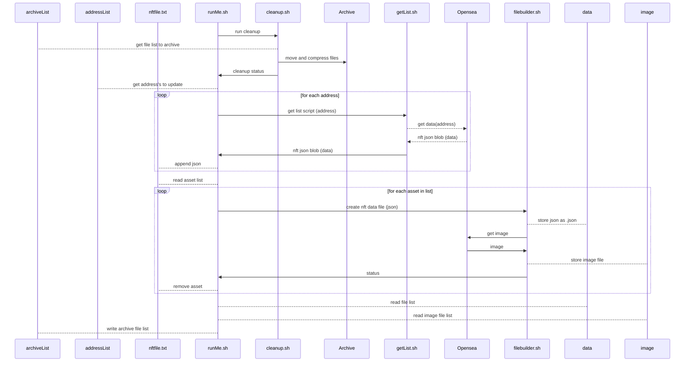

```mermaid
sequenceDiagram

    participant arch as archiveList
    participant al as addressList
    participant nf as nftfile.txt

    participant core as runMe.sh
    participant cl as cleanup.sh 
    participant ar as Archive
    participant gl as getList.sh
    participant os as Opensea
    participant fb as filebuilder.sh
    
    core ->> cl: run cleanup
    cl --> arch: get file list to archive
    cl ->> ar: move and compress files 
    cl ->> core : cleanup status
    core --> al: get address's to update
    loop for each address
        core ->> gl : get list script (address)
        gl -->> os : get data(address)
        os -->> gl : nft json blob (data)
        gl ->> core : nft json blob (data)
        core --> nf : append json
    end
    core --> nf : read asset list
    loop for each asset in list
        core ->> fb : create nft data file (json)
        fb --> data : store json as .json
        fb ->> os : get image
        os ->> fb : image
        fb --> image : store image file 
        fb ->> core : status
        core --> nf : remove asset
    end
    core --> data : read file list
    core --> image : read image file list
    core --> arch : write archive file list

```