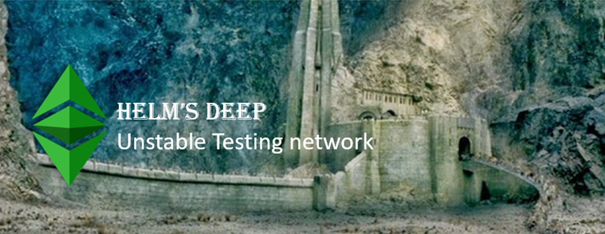

# Helm's Deep 

## An unstable testing network

This network is intended for deployment and testing of experimental code and clients. Open endpoints are for development and transparency only


## Work Flow
``` 
                  Docker hub                - HD_MINER_1
                   /\                       - HD_MINER_2
                   ||                       - HD_NODE_3
Code => Github => Jenkins => docker-compose - HD_NODE_4       => elk
                   /\                       - HD_NODE_5
                   ||                       - HD_NODE_6
                  Vault
```
                  
                  
## Test plan

| Nodes  | Fork block |Status | Date |
